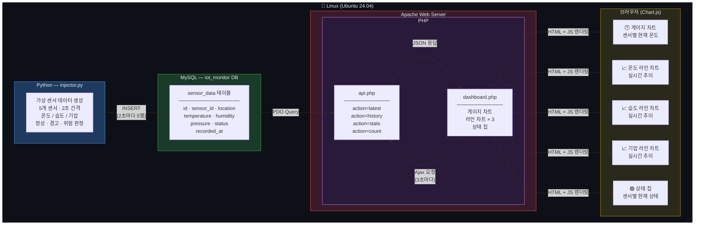
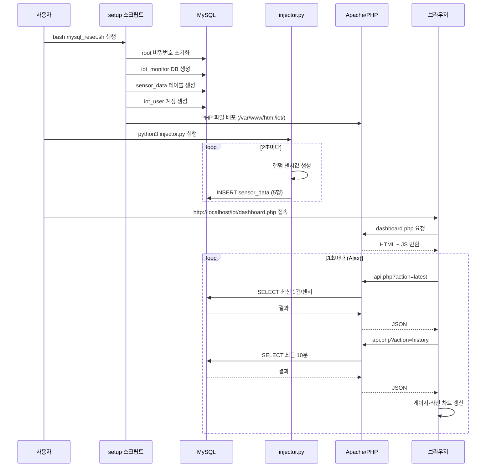

# 3주차 — LAMP Stack IoT 실시간 모니터링 시스템

## 개요

LAMP Stack(Linux · Apache · MySQL · PHP)을 활용하여 가상 IoT 센서 데이터를 생성·저장하고,
웹 브라우저에서 실시간으로 모니터링할 수 있는 대시보드를 구현한 프로젝트입니다.

---

## 전체 시스템 블럭도



---

## 작업 순서



---

## 파일 구조

```
3week/
├── process.md          # 프로젝트 설명 (현재 파일)
├── setup_db.sql        # MySQL DB / 테이블 / 유저 초기화 SQL
├── setup.sh            # LAMP 환경 자동 설정 스크립트
├── mysql_reset.sh      # MySQL root 비밀번호 초기화 스크립트
├── injector.py         # 가상 IoT 데이터 생성 및 DB 삽입 (Python)
└── iot/
    ├── api.php         # REST JSON API (Apache + PHP + MySQL)
    └── dashboard.php   # 실시간 모니터링 대시보드 (Chart.js)
```

---

## 구성 요소 상세

### 1. injector.py — 데이터 생성기

| 항목 | 내용 |
|------|------|
| 센서 수 | 5개 (S001 ~ S005) |
| 측정 항목 | 온도(°C) · 습도(%) · 기압(hPa) |
| 삽입 주기 | 2초마다 5행 배치 INSERT |
| 이상값 | 5% 확률 온도 스파이크, 2% 확률 습도 급등 |
| 상태 판정 | normal / warning(28°C↑ 또는 75%↑) / critical(35°C↑ 또는 90%↑) |

### 2. MySQL — sensor_data 테이블

| 컬럼 | 타입 | 설명 |
|------|------|------|
| id | BIGINT AUTO_INCREMENT | 기본키 |
| sensor_id | VARCHAR(20) | 센서 식별자 |
| location | VARCHAR(50) | 설치 위치 |
| temperature | DECIMAL(5,2) | 온도 (°C) |
| humidity | DECIMAL(5,2) | 습도 (%) |
| pressure | DECIMAL(7,2) | 기압 (hPa) |
| status | ENUM | normal / warning / critical |
| recorded_at | TIMESTAMP | 기록 시각 (자동) |

### 3. api.php — JSON API 엔드포인트

| 엔드포인트 | 설명 |
|-----------|------|
| `?action=latest` | 센서별 최신 데이터 1건 (게이지 카드용) |
| `?action=history&minutes=10` | 최근 N분 시계열 전체 (라인 차트용) |
| `?action=stats` | 센서별 1시간 통계 (평균·최대·최소) |
| `?action=count` | 전체 레코드 수 |

### 4. dashboard.php — 실시간 대시보드

| 구성 요소 | 설명 |
|-----------|------|
| 게이지 차트 × 5 | 센서별 현재 온도를 반원형 도넛 차트로 표시 |
| 온도 라인 차트 | 5개 센서 실시간 온도 추이 (최근 60포인트) |
| 습도 라인 차트 | 5개 센서 실시간 습도 추이 |
| 기압 라인 차트 | 5개 센서 실시간 기압 추이 |
| 상태 칩 | 센서별 현재 상태 요약 |
| 갱신 주기 | 3초마다 Ajax로 자동 갱신 (페이지 새로고침 없음) |

---

## 실행 방법

### 초기 설정 (최초 1회)

```bash
# MySQL 초기화 + PHP 파일 배포 자동화
bash ~/Desktop/3week/mysql_reset.sh
```

### 데이터 주입 시작

```bash
python3 ~/Desktop/3week/injector.py
# 옵션: --interval 2 (간격 초), --count 100 (횟수 제한)
```

### 대시보드 접속

```
http://localhost/iot/dashboard.php
```

---

## 기술 스택

| 구분 | 기술 |
|------|------|
| OS | Linux (Ubuntu 24.04) |
| Web Server | Apache 2.4 |
| Database | MySQL 8.0 |
| Backend | PHP 8.3 + PDO |
| Frontend | Chart.js 4.4 (게이지·라인 차트) |
| Data Generator | Python 3 + mysql-connector-python |
