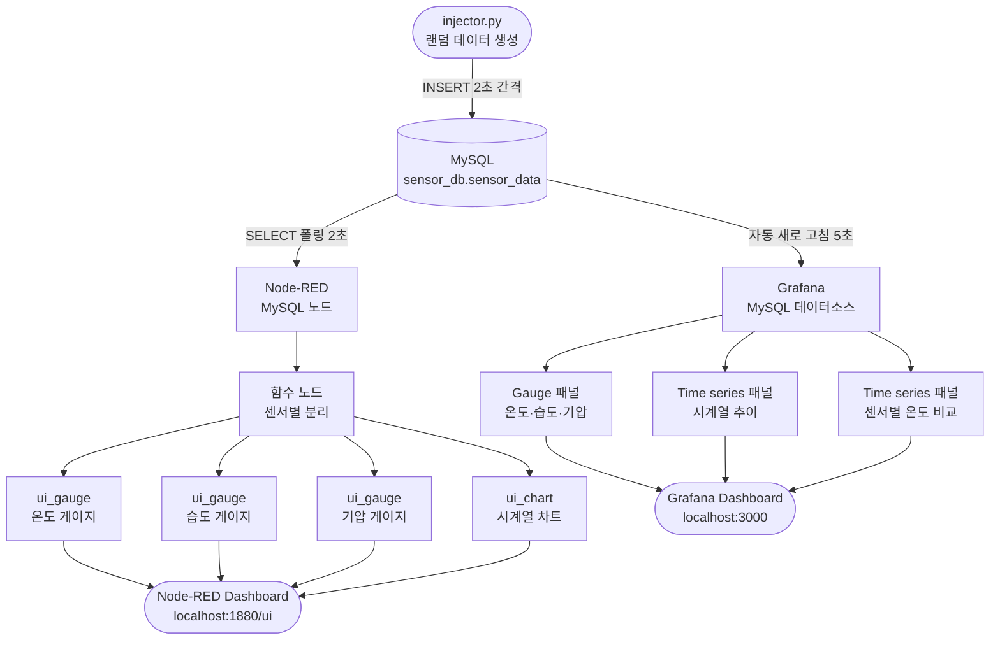
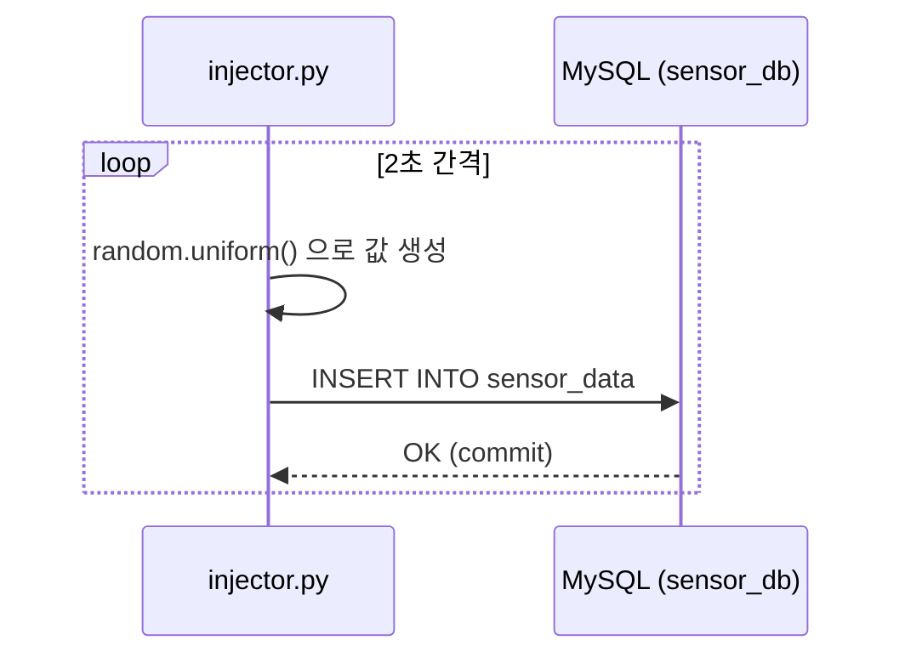
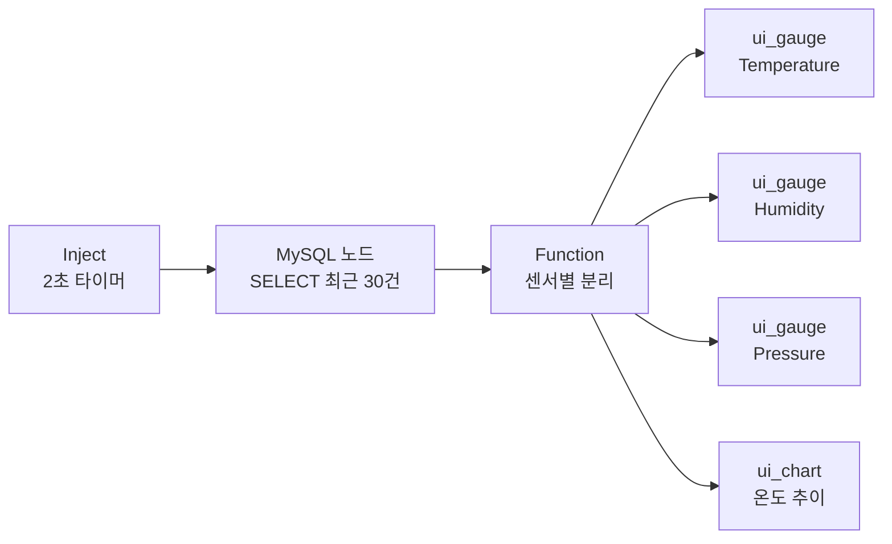
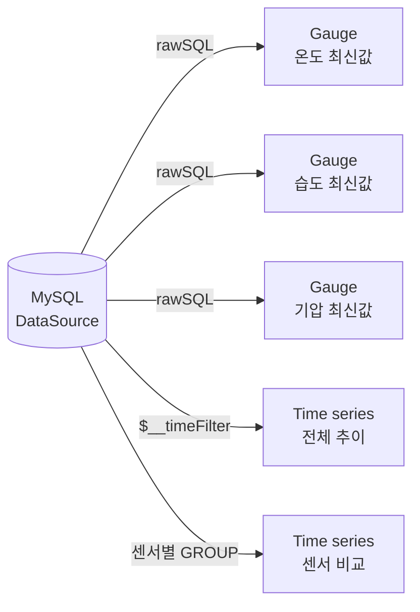

# 4week 프로젝트: 실시간 센서 데이터 모니터링 시스템

## 개요

Python `injector.py`가 랜덤 센서 데이터를 MySQL(LAMP)에 2초 간격으로 삽입하면,
**Node-RED**와 **Grafana** 두 가지 경로로 실시간 대시보드를 구성합니다.

---

## 시스템 구성 요소

| 구성 요소 | 역할 |
|-----------|------|
| `injector.py` | 랜덤 온도·습도·기압 데이터 생성 → MySQL 삽입 |
| MySQL (LAMP) | 센서 데이터 영구 저장소 (`sensor_db.sensor_data`) |
| Node-RED | MySQL 폴링 → 게이지·차트 대시보드 (포트 1880) |
| Grafana | MySQL 데이터소스 연동 → 시계열 대시보드 (포트 3000) |

---

## 전체 데이터 흐름



---

## 상세 동작 설명

### 1. injector.py — 데이터 생성 및 주입

- **센서 목록**: `SENSOR-01`, `SENSOR-02`, `SENSOR-03`
- **생성 범위**
  - 온도: 15 ~ 40 °C
  - 습도: 30 ~ 90 %
  - 기압: 980 ~ 1050 hPa
- 2초마다 센서 3개 × 1건 = **6건/분** 삽입



### 2. Node-RED 흐름 (flow.json)



- Node-RED 대시보드: `http://localhost:1880/ui`
- 필요 팔레트: `node-red-dashboard`, `node-red-node-mysql`

### 3. Grafana 대시보드 (dashboard.json)



- Grafana 대시보드: `http://localhost:3000`
- 새로 고침: 5초 자동
- 조회 범위: 최근 30분 (슬라이더로 조정 가능)

---

## 실행 순서

```bash
# 1. DB 초기화
mysql -u root < sql/schema.sql

# 2. 데이터 주입 시작
pip install mysql-connector-python
python3 injector.py

# 3-A. Node-RED 대시보드 확인
#   node-red 실행 후 flow.json 임포트
#   http://localhost:1880/ui

# 3-B. Grafana 대시보드 확인
#   datasource.yaml → /etc/grafana/provisioning/datasources/
#   dashboard.json  → Grafana UI에서 Import
#   http://localhost:3000
```

---

## 파일 구조

```
4week/
├── injector.py              # 랜덤 데이터 생성 및 MySQL 주입
├── sql/
│   └── schema.sql           # DB·테이블 생성 스크립트
├── node-red/
│   └── flow.json            # Node-RED 플로우 (대시보드 포함)
├── grafana/
│   ├── dashboard.json       # Grafana 대시보드 정의
│   └── datasource.yaml      # Grafana MySQL 데이터소스 프로비저닝
└── project.md               # 프로젝트 문서 (이 파일)
```
