# 태양광 에너지 기반 스마트 농업 시스템

## 시스템 블럭도

```mermaid
graph TD
    A[태양광 패널\nSolar Panel] --> B[충전 컨트롤러\nCharge Controller]
    B --> C[배터리 팩\nBattery Pack]
    B --> D[인버터\nInverter]
    C --> D

    D --> E[메인 전력 분배기\nPower Distributor]

    E --> F[제어 시스템\nControl System]
    F --> G[마이크로컨트롤러\nMicrocontroller / MCU]

    G --> H[관개 시스템\nIrrigation System]
    G --> I[온실 환경 제어\nGreenhouse Control]
    G --> J[토양 센서 시스템\nSoil Sensor System]
    G --> K[조명 시스템\nLED Grow Light]
    G --> L[기상 모니터링\nWeather Monitoring]

    H --> H1[워터 펌프\nWater Pump]
    H --> H2[전자 밸브\nSolenoid Valve]
    H --> H3[드립 관개\nDrip Irrigation]

    I --> I1[환풍기\nVentilation Fan]
    I --> I2[히터\nHeater]
    I --> I3[보온 커튼\nThermal Curtain]

    J --> J1[토양 수분 센서\nSoil Moisture Sensor]
    J --> J2[토양 온도 센서\nSoil Temp Sensor]
    J --> J3[pH 센서\npH Sensor]

    L --> L1[온습도 센서\nTemp & Humidity]
    L --> L2[일사량 센서\nSolar Irradiance]
    L --> L3[풍속 센서\nWind Sensor]

    G --> M[데이터 통신\nCommunication]
    M --> M1[Wi-Fi / IoT 모듈]
    M1 --> M2[클라우드 서버\nCloud Server]
    M2 --> M3[모바일 앱 / 웹 대시보드\nUser Interface]

    style A fill:#FFD700,stroke:#FFA500,color:#000
    style B fill:#87CEEB,stroke:#4682B4,color:#000
    style C fill:#90EE90,stroke:#228B22,color:#000
    style D fill:#FFA07A,stroke:#FF4500,color:#000
    style E fill:#DDA0DD,stroke:#800080,color:#000
    style G fill:#F0E68C,stroke:#DAA520,color:#000
    style M2 fill:#B0C4DE,stroke:#4169E1,color:#000
```

## 시스템 구성 설명

| 구성 요소 | 역할 |
|---|---|
| **태양광 패널** | 태양 에너지를 직류(DC) 전기로 변환 |
| **충전 컨트롤러** | 배터리 과충전/과방전 방지 및 전력 조절 |
| **배터리 팩** | 야간 및 흐린 날 전력 저장 및 공급 |
| **인버터** | DC → AC 변환, 농업 장치에 교류 전원 공급 |
| **메인 전력 분배기** | 각 시스템에 전력 분배 |
| **마이크로컨트롤러** | 센서 데이터 수집 및 장치 제어 |
| **관개 시스템** | 자동 물 공급 및 드립 관개 제어 |
| **온실 환경 제어** | 온도·습도 자동 조절 |
| **토양 센서 시스템** | 토양 수분, 온도, pH 실시간 모니터링 |
| **조명 시스템** | 작물 생장용 LED 보광 제어 |
| **기상 모니터링** | 외부 환경 데이터 수집 |
| **IoT 통신** | 클라우드 연동 및 원격 모니터링/제어 |
