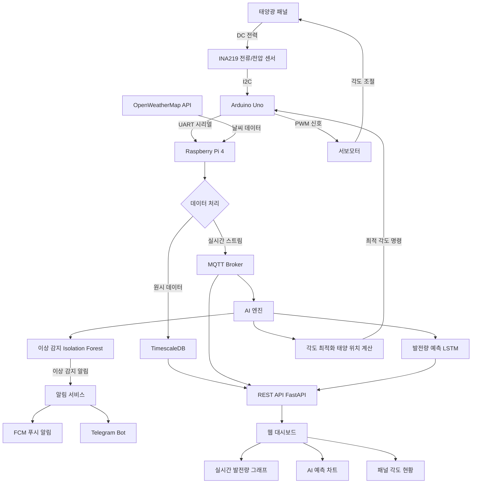

# 태양광 스마트 모니터링 시스템
**Smart Solar Panel Monitoring System with AI**

> 태양광 패널의 발전량을 실시간으로 수집하고, AI로 예측 및 이상 감지, 패널 각도 자동 최적화까지 하는 스마트 모니터링 시스템

---

## 목차
1. [프로젝트 개요](#1-프로젝트-개요)
2. [시스템 블록도](#2-시스템-블록도)
3. [하드웨어 구성](#3-하드웨어-구성)
4. [소프트웨어 아키텍처](#4-소프트웨어-아키텍처)
5. [AI 기능 상세](#5-ai-기능-상세)
6. [디렉토리 구조](#6-디렉토리-구조)
7. [개발 로드맵](#7-개발-로드맵)
8. [기술 스택](#8-기술-스택)
9. [데이터 흐름](#9-데이터-흐름)
10. [설치 및 실행](#10-설치-및-실행)

---

## 1. 프로젝트 개요

### 목표
소형 태양광 패널을 대상으로 실시간 발전량 모니터링, AI 기반 발전량 예측 및 이상 감지, 서보모터를 활용한 패널 각도 자동 최적화를 구현하는 캡스톤 프로젝트.

### 핵심 가치
| 항목 | 내용 |
|------|------|
| 실시간성 | 전류/전압 데이터를 초 단위로 수집·시각화 |
| AI 예측 | 날씨 + 과거 데이터로 다음날 발전량 예측 |
| 이상 감지 | 갑작스러운 발전량 저하 자동 알림 |
| 자동 최적화 | 태양 위치 계산 기반 패널 각도 자동 제어 |
| 확장성 | 1학기: 공식 기반 / 2학기: 강화학습 고도화 |

---

## 2. 시스템 블록도

### 전체 시스템 구성도

```
┌─────────────────────────────────────────────────────────────────────────┐
│                         SOLAR MONITORING SYSTEM                         │
└─────────────────────────────────────────────────────────────────────────┘

  ┌──────────────┐
  │  태양광 패널  │
  │  (소형 패널)  │
  └──────┬───────┘
         │ DC 전력
         ▼
  ┌──────────────┐      시리얼(UART)      ┌─────────────────────────────┐
  │   전류/전압   │ ──────────────────────▶│                             │
  │    센서       │                        │      Raspberry Pi 4         │
  │  (INA219)    │                        │                             │
  └──────────────┘                        │  ┌────────────────────────┐ │
                                          │  │   데이터 수집 모듈       │ │
  ┌──────────────┐      시리얼(UART)      │  │  - 센서 데이터 파싱     │ │
  │   Arduino    │ ──────────────────────▶│  │  - 전처리 & 검증        │ │
  │  (센서 중계)  │◀──────────────────────│  │  - MQTT 발행            │ │
  │              │      제어 명령          │  └────────────┬───────────┘ │
  └──────┬───────┘                        │               │             │
         │ PWM                            │  ┌────────────▼───────────┐ │
         ▼                                │  │   AI 처리 모듈          │ │
  ┌──────────────┐                        │  │  - 발전량 예측 (LSTM)   │ │
  │  서보모터    │◀───────────────────────│  │  - 이상 감지 (Isolation │ │
  │  (패널 각도) │      각도 명령          │  │    Forest)              │ │
  └──────────────┘                        │  │  - 각도 최적화          │ │
                                          │  └────────────┬───────────┘ │
  ┌──────────────┐                        │               │             │
  │  날씨 API    │ ──────────────────────▶│  ┌────────────▼───────────┐ │
  │  (OpenWeather│      날씨 데이터        │  │   통신 모듈             │ │
  │   Map)       │                        │  │  - MQTT Broker          │ │
  └──────────────┘                        │  │  - REST API 전송        │ │
                                          │  │  - 푸시 알림            │ │
                                          │  └────────────────────────┘ │
                                          └──────────────┬──────────────┘
                                                         │ MQTT / HTTP
                                                         ▼
                                          ┌──────────────────────────────┐
                                          │         백엔드 서버            │
                                          │                              │
                                          │  ┌─────────────────────────┐ │
                                          │  │   FastAPI / Flask        │ │
                                          │  │   REST API               │ │
                                          │  └────────────┬────────────┘ │
                                          │               │              │
                                          │  ┌────────────▼────────────┐ │
                                          │  │   데이터베이스            │ │
                                          │  │   TimescaleDB (시계열)   │ │
                                          │  │   + SQLite (로컬 백업)   │ │
                                          │  └────────────┬────────────┘ │
                                          │               │              │
                                          │  ┌────────────▼────────────┐ │
                                          │  │   알림 서비스            │ │
                                          │  │   FCM / Telegram Bot     │ │
                                          │  └─────────────────────────┘ │
                                          └──────────────┬───────────────┘
                                                         │ HTTP / WebSocket
                                                         ▼
                                          ┌──────────────────────────────┐
                                          │        대시보드 (Web)          │
                                          │                              │
                                          │  ┌─────────────────────────┐ │
                                          │  │   실시간 발전량 그래프    │ │
                                          │  │   (Chart.js / Grafana)   │ │
                                          │  └─────────────────────────┘ │
                                          │  ┌─────────────────────────┐ │
                                          │  │   AI 예측 결과 표시      │ │
                                          │  │   이상 감지 알림         │ │
                                          │  └─────────────────────────┘ │
                                          │  ┌─────────────────────────┐ │
                                          │  │   패널 각도 현황 / 제어  │ │
                                          │  └─────────────────────────┘ │
                                          └──────────────────────────────┘
                                                         │
                                                         ▼
                                          ┌──────────────────────────────┐
                                          │       스마트폰 앱 / 알림       │
                                          │  FCM 푸시 알림 / Telegram     │
                                          └──────────────────────────────┘
```

### 데이터 흐름 다이어그램 (Mermaid)



---

## 3. 하드웨어 구성

### 부품 목록 (BOM)

| 부품 | 모델 | 수량 | 역할 |
|------|------|------|------|
| 메인 컴퓨터 | Raspberry Pi 4 (2GB+) | 1 | 데이터 수집, AI 처리, 통신 |
| 마이크로컨트롤러 | Arduino Uno / Nano | 1 | 센서 데이터 읽기, 서보 제어 |
| 태양광 패널 | 5V~12V 소형 패널 | 1 | 발전 대상 |
| 전류/전압 센서 | INA219 (I2C) | 1 | 전류·전압·전력 측정 |
| 서보모터 | MG996R (토크 큰 모델) | 1~2 | 패널 방위각/고도각 조절 |
| 실시간 시계 | DS3231 RTC | 1 | 정확한 타임스탬프 |
| 저항 | 분압저항 등 | 다수 | 회로 보호 |

### 하드웨어 연결 다이어그램

```
INA219 (I2C: 0x40)
  ├── VCC  → Arduino 5V
  ├── GND  → Arduino GND
  ├── SDA  → Arduino A4
  ├── SCL  → Arduino A5
  ├── VIN+ → 패널 양극(+)
  └── VIN- → 부하 양극

Arduino → Raspberry Pi
  ├── TX  → RPi GPIO15 (RX)
  ├── RX  → RPi GPIO14 (TX)
  └── GND → RPi GND (공통)

Arduino → 서보모터
  ├── D9  → 서보1 신호선 (방위각)
  └── D10 → 서보2 신호선 (고도각)
```

---

## 4. 소프트웨어 아키텍처

### 레이어 구조

```
┌─────────────────────────────────────────┐
│           대시보드 (React / Grafana)      │  ← 사용자 인터페이스
├─────────────────────────────────────────┤
│        백엔드 API (FastAPI)               │  ← REST API / WebSocket
├─────────────────────────────────────────┤
│    AI 엔진 (Prediction / Anomaly / Opt)  │  ← AI 처리
├─────────────────────────────────────────┤
│       데이터베이스 (TimescaleDB)          │  ← 시계열 데이터 저장
├─────────────────────────────────────────┤
│     MQTT Broker (Mosquitto)              │  ← 메시지 버스
├─────────────────────────────────────────┤
│      펌웨어 (Raspberry Pi Python)        │  ← 엣지 컴퓨팅
├─────────────────────────────────────────┤
│     Arduino 스케치 (센서 + 서보)          │  ← 하드웨어 추상화
├─────────────────────────────────────────┤
│         하드웨어 (센서, 모터, 패널)        │  ← 물리 계층
└─────────────────────────────────────────┘
```

---

## 5. AI 기능 상세

### 5-1. 발전량 예측 (Power Generation Forecast)
- **모델**: LSTM (Long Short-Term Memory) 시계열 예측
- **입력**: 과거 7일 발전량 데이터 + 내일 날씨 예보 (일조량, 기온, 구름량)
- **출력**: 내일 시간대별 예상 발전량 (kWh)
- **학습 주기**: 매주 재학습 (새 데이터 누적)

### 5-2. 이상 감지 (Anomaly Detection)
- **모델**: Isolation Forest + 규칙 기반 하이브리드
- **감지 조건**:
  - 맑은 날 발전량이 예측값의 30% 이하로 떨어질 때
  - 전압 또는 전류가 정상 범위를 벗어날 때
  - 발전량이 급격하게 감소하는 패턴 감지
- **알림**: FCM 푸시 알림 + 대시보드 경고 표시

### 5-3. 패턴 분석 (Pattern Analysis)
- 시간대별 발전 효율 히트맵
- 계절별 발전량 통계 리포트 자동 생성
- 날씨 조건별 발전 성능 상관관계 분석

### 5-4. 각도 최적화 (Angle Optimization)

**1학기 - 태양 위치 계산 기반:**
```
태양 고도각(α) = arcsin(sin(φ)·sin(δ) + cos(φ)·cos(δ)·cos(H))
태양 방위각(A) = arccos((sin(δ) - sin(α)·sin(φ)) / (cos(α)·cos(φ)))

φ = 위도, δ = 태양 적위, H = 시간각
```
- `astral` 라이브러리로 현재 위치의 태양 고도각·방위각 계산
- 계산된 최적 각도를 서보모터로 전달

**2학기 - 강화학습 기반 (예정):**
- 환경(Environment): 태양광 패널 + 날씨 조건
- 상태(State): 현재 각도, 발전량, 시간, 날씨
- 행동(Action): 각도 조절 (±n°)
- 보상(Reward): 발전량 증가량
- 알고리즘: PPO (Proximal Policy Optimization)

---

## 6. 디렉토리 구조

```
solar-monitor/
│
├── project.md                      # 이 파일
│
├── firmware/                       # Raspberry Pi 펌웨어 (Python)
│   ├── main.py                     # 진입점 - SystemOrchestrator
│   ├── config.yaml                 # 전체 설정 (핀, MQTT, 임계값)
│   ├── requirements.txt
│   ├── core/
│   │   ├── event_bus.py            # 이벤트 버스 (pub/sub)
│   │   └── logger.py               # 로깅 설정
│   ├── sensors/
│   │   └── serial_reader.py        # Arduino 시리얼 데이터 수신
│   ├── actuators/
│   │   └── servo_command.py        # 서보 명령 전송 (Arduino로)
│   ├── communication/
│   │   ├── mqtt_client.py          # MQTT 발행/구독
│   │   └── weather_api.py          # OpenWeatherMap API 클라이언트
│   ├── control/
│   │   ├── angle_optimizer.py      # 태양 위치 기반 각도 계산
│   │   └── safety_monitor.py       # 안전 한계 감시
│   └── tests/
│       └── test_*.py
│
├── arduino/                        # Arduino 스케치
│   └── sensor_reader/
│       └── sensor_reader.ino       # INA219 읽기 + 서보 제어 + 시리얼 출력
│
├── ai/                             # AI 모델 (Python)
│   ├── prediction/
│   │   ├── train.py                # LSTM 모델 학습
│   │   ├── inference.py            # 발전량 예측 추론
│   │   └── model/                  # 학습된 모델 저장
│   ├── anomaly/
│   │   ├── detector.py             # Isolation Forest 이상 감지
│   │   └── rules.py                # 규칙 기반 보조 감지
│   └── optimization/
│       ├── solar_position.py       # 태양 위치 계산
│       └── rl_agent.py             # (2학기) 강화학습 에이전트
│
├── backend/                        # 서버 (Python - FastAPI)
│   ├── main.py                     # FastAPI 앱 진입점
│   ├── requirements.txt
│   ├── api/
│   │   ├── routes_data.py          # GET /data, GET /history
│   │   ├── routes_ai.py            # GET /prediction, GET /anomaly
│   │   └── routes_control.py       # POST /angle
│   ├── database/
│   │   ├── models.py               # 데이터 모델
│   │   ├── crud.py                 # DB CRUD 함수
│   │   └── connection.py           # DB 연결
│   └── notifications/
│       ├── fcm.py                  # Firebase 푸시 알림
│       └── telegram_bot.py         # Telegram 알림
│
├── dashboard/                      # 웹 대시보드 (React)
│   ├── package.json
│   ├── src/
│   │   ├── App.jsx
│   │   ├── components/
│   │   │   ├── PowerChart.jsx      # 실시간 발전량 그래프
│   │   │   ├── PredictionChart.jsx # AI 예측 차트
│   │   │   ├── AngleDisplay.jsx    # 패널 각도 현황
│   │   │   ├── AnomalyAlert.jsx    # 이상 감지 알림
│   │   │   └── DailyReport.jsx     # 일간 리포트
│   │   └── api/
│   │       └── client.js           # 백엔드 API 호출
│   └── public/
│
└── docs/
    ├── block_diagram.md            # 상세 블록도 문서
    ├── hardware_setup.md           # 하드웨어 조립 가이드
    └── api_spec.md                 # API 명세서
```

---

## 7. 개발 로드맵

### 1학기 목표 (2026년 1~6월)

```
3월  │██ 하드웨어 조립 + Arduino INA219 연동
4월  │████ 펌웨어 개발 (시리얼 통신, MQTT, 데이터 수집)
5월  │████ AI 개발 (LSTM 예측, Isolation Forest 이상 감지)
     │     + 태양 위치 기반 각도 최적화 구현
6월  │████ 대시보드 + 백엔드 API + 푸시 알림 연동
     │     시스템 통합 테스트 + 발표 준비
```

| 마일스톤 | 기간 | 세부 내용 |
|----------|------|-----------|
| M1: 하드웨어 셋업 | 3월 | Arduino-INA219-서보 연결, 시리얼 통신 확인 |
| M2: 데이터 수집 | 4월 초 | Raspberry Pi 펌웨어, MQTT, DB 저장 |
| M3: AI 기본 | 4월~5월 | LSTM 학습, 이상 감지 모델 |
| M4: 각도 최적화 | 5월 | 태양 위치 계산 → 서보 자동 제어 |
| M5: 대시보드 | 6월 초 | React 대시보드, 알림 시스템 |
| M6: 통합 테스트 | 6월 말 | 전체 시스템 통합, 실외 테스트 |

### 2학기 목표 (2026년 9~12월)
- 강화학습(PPO) 기반 각도 최적화 고도화
- 더 긴 기간 데이터로 LSTM 모델 재학습
- 다중 패널 확장 지원
- 자동 리포트 생성 및 이메일 발송

---

## 8. 기술 스택

| 영역 | 기술 |
|------|------|
| 펌웨어 | Python 3.11, pyserial, paho-mqtt, astral, APScheduler |
| Arduino | C++ (Arduino Framework), Wire, Servo, INA219 라이브러리 |
| AI | Python, PyTorch (LSTM), scikit-learn (Isolation Forest), pandas, numpy |
| 백엔드 | Python, FastAPI, SQLAlchemy, TimescaleDB (PostgreSQL) |
| 메시지 브로커 | MQTT (Eclipse Mosquitto) |
| 대시보드 | React, Chart.js, WebSocket |
| 알림 | Firebase FCM, python-telegram-bot |
| 날씨 | OpenWeatherMap API |
| 인프라 | Docker Compose (로컬 배포) |

---

## 9. 데이터 흐름

### 실시간 측정 데이터 스키마 (JSON)
```json
{
  "timestamp": "2026-04-15T10:30:00+09:00",
  "panel": {
    "voltage_V": 17.82,
    "current_A": 1.24,
    "power_W": 22.1,
    "energy_Wh_today": 145.6
  },
  "panel_angle": {
    "azimuth_deg": 180.5,
    "elevation_deg": 42.3,
    "optimal_azimuth_deg": 181.0,
    "optimal_elevation_deg": 43.0
  },
  "weather": {
    "temperature_C": 18.5,
    "cloud_coverage_pct": 20,
    "solar_irradiance_Wm2": 650
  },
  "anomaly": {
    "detected": false,
    "score": 0.12,
    "reason": null
  }
}
```

### AI 예측 결과 스키마 (JSON)
```json
{
  "prediction_date": "2026-04-16",
  "generated_at": "2026-04-15T20:00:00+09:00",
  "hourly_forecast": [
    {"hour": 6, "predicted_power_W": 5.2, "confidence": 0.91},
    {"hour": 7, "predicted_power_W": 12.8, "confidence": 0.89},
    {"hour": 12, "predicted_power_W": 28.4, "confidence": 0.87}
  ],
  "total_forecast_Wh": 198.5,
  "weather_conditions": "맑음",
  "model_version": "v1.2.0"
}
```

---

## 10. 설치 및 실행

### 사전 요구사항
- Raspberry Pi OS (64-bit)
- Python 3.11+
- Docker, Docker Compose (백엔드 서버)
- Node.js 18+ (대시보드)

### 빠른 시작

```bash
# 1. 저장소 클론
git clone <repo-url>
cd solar-monitor

# 2. 백엔드 + DB + MQTT 브로커 실행
docker-compose up -d

# 3. 펌웨어 실행 (Raspberry Pi에서)
cd firmware
pip install -r requirements.txt
python main.py

# 4. 대시보드 실행
cd dashboard
npm install
npm start
# → http://localhost:3000
```

### 설정 파일 (`firmware/config.yaml`)
```yaml
serial:
  port: /dev/ttyUSB0   # Arduino 연결 포트
  baud_rate: 9600

mqtt:
  broker: localhost
  port: 1883
  topic_prefix: solar/

location:
  latitude: 37.5665    # 서울 위도
  longitude: 126.9780  # 서울 경도

angle:
  min_elevation: 0
  max_elevation: 90
  update_interval_minutes: 15

anomaly:
  power_drop_threshold: 0.30    # 예측값 대비 30% 이하 = 이상
  voltage_min: 10.0
  voltage_max: 22.0
```

---

*최종 수정: 2026-03-16*
