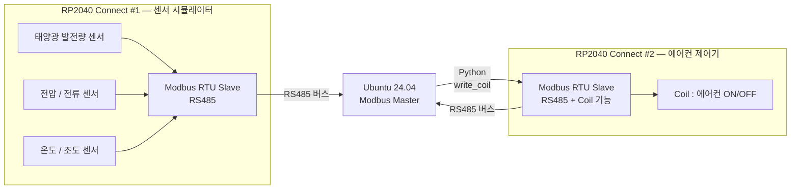
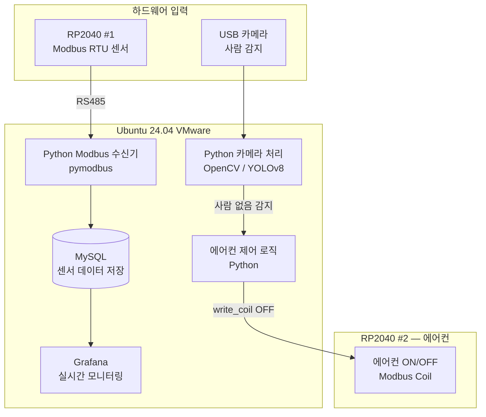
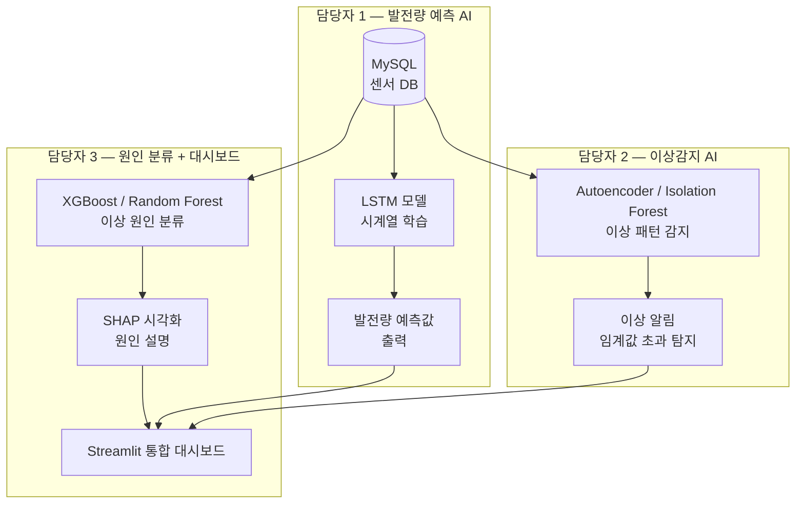
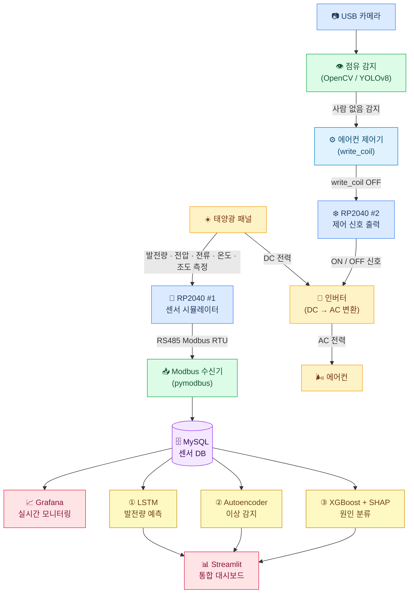

# Solar AI 캡스톤 프로젝트 정리

## 프로젝트 개요

태양광 쉼터 스마트 모니터링 & AI 분석 시스템으로, 하드웨어 시뮬레이션부터 AI 예측/이상감지까지 통합하는 3인 프로젝트입니다.

---

## 블록도 1 — 하드웨어 레이어 (Modbus RTU)

---

## 블록도 2 — 서버 / 데이터 파이프라인 (Ubuntu LAMP)

---

## 블록도 3 — AI 모델 역할 분담 (3인)

---

## 블록도 4 — 전체 시스템 동작 흐름

---

## 역할 분담 요약표

| 담당자 | 담당 영역 | 핵심 기술 |
|--------|-----------|-----------|
| **1번** | 발전량 예측 AI | LSTM, 시계열 전처리, 예측 정확도 평가 |
| **2번** | 이상감지 AI | Autoencoder / Isolation Forest, 임계값 설계 |
| **3번** | 원인 분류 + 대시보드 | XGBoost/RF, SHAP, Streamlit 통합 UI |

> **공통 인프라** (협력): RP2040 Modbus 펌웨어, Ubuntu LAMP 구축, MySQL 스키마 설계
